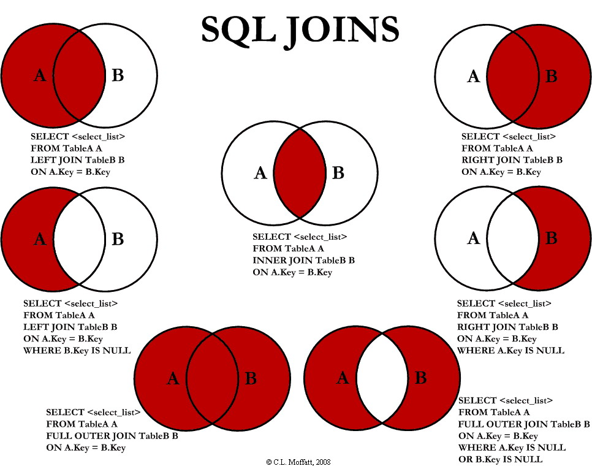

## mysql cheat sheets
1. SQL JOINS

	
	
	原文链接:[http://stackoverflow.com/questions/5706437/whats-the-difference-between-inner-join-left-join-right-join-and-full-join](http://stackoverflow.com/questions/5706437/whats-the-difference-between-inner-join-left-join-right-join-and-full-join "whats-the-difference-between-inner-join-left-join-right-join-and-full-join")
2. MySQL十进制转化为二进制、八进制、十六进制 
	- BIN(N）返回二进制值N的一个字符串表示

		    > select bin(124);
    		+----------+
    		| bin(124) |
    		+----------+
    		| 1111100  |
    		+----------+
    		1 row in set (0.00 sec)
	- OCT(N）返回八进制值N的一个字符串表示

    	    >select oct(124);
	    	+----------+
	    	| oct(124) |
	    	+----------+
	    	| 174      |
	    	+----------+
	    	1 row in set (0.00 sec)
	- HEX(N）返回十六进制值N的一个字符串表示
	
		    >select hex(124);
    		+----------+
    		| hex(124) |
    		+----------+
    		| 7C       |
    		+----------+
    		1 row in set (0.00 sec)

	
3. MySQL日期 字符串 时间戳互转 
	- 获取当前时间
		
		    >SELECT now();
    		+---------------------+
    		| now()   			  |
    		+---------------------+
    		| 2017-04-10 15:20:16 |
    		+---------------------+
    		1 row in set (0.01 sec)
	- 时间转化格式
		
		    >SELECT date_format(now(), '%Y-%m-%d');
    		+--------------------------------+
    		| date_format(now(), '%Y-%m-%d') |
    		+--------------------------------+
    		| 2017-04-10 					 |
    		+--------------------------------+
    		1 row in set (0.00 sec)
	- 获取当前的时间戳
		
		    >SELECT unix_timestamp(now());  
			+-----------------------+
			| unix_timestamp(now()) |
			+-----------------------+
			|1491809113             |
			+-----------------------+
			1 row in set (0.00 sec)
	- 时间戳转字符串
		
		    >SELECT from_unixtime(1491809381,'%Y-%m-%d %H:%i:%s');
    		+-----------------------------------------------+
    		| from_unixtime(1491809381,'%Y-%m-%d %H:%i:%s') |
    		+-----------------------------------------------+
    		| 2017-04-10 15:29:41   						|
    		+-----------------------------------------------+
    		1 row in set (0.00 sec)

4. 字符截取函数

SUBSTR function returns the sub string within a string.

Syntax:

**SUBSTR(string, start_position, length)**

or

**SUBSTRING (string, start_position, length)**

In MySQL both SUBSTR and SUBSTRING will work. SUBSTR is in ANSI standard.

PS:此处有坑，start_position 起始值为： 1  

**SUBSTRING_INDEX**

	SELECT SUBSTRING_INDEX('www.mysql.com', '.', 2);
	 // ouput 'www.mysql'
**LEFT(str,len)**  
返回字符串str的最左面len个字符。

**RIGHT(str,len)**  
返回字符串str的最右面len个字符。

5.有外键约束的情况下，删除表

	SET foreign_key_checks = 0;
	-- Drop tables
	DROP TABLE table_name;
	-- Drop views
	DROP VIEW view_name;
	SET foreign_key_checks = 1;