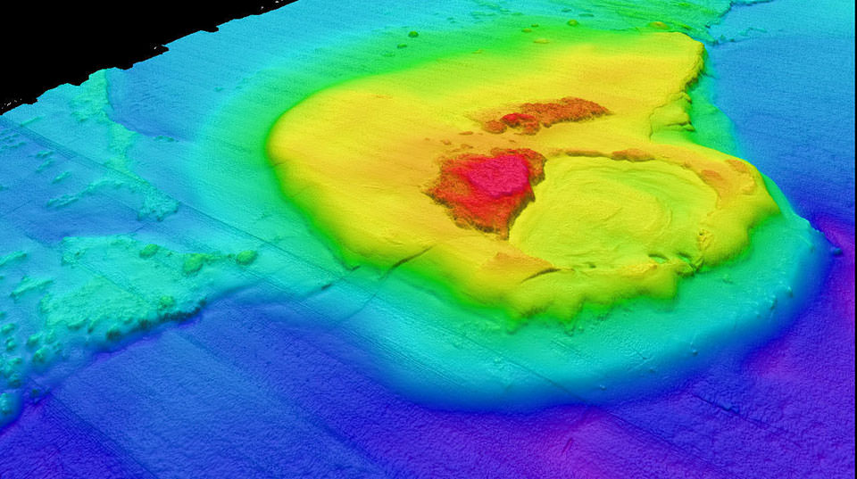

## bathymetry 测深
- Bathymetry is the study of the "beds" or "floors" of water bodies, including the ocean, rivers, streams, and lakes.
- Bathymetry map of East Flower Garden Bank.

- The term "bathymetry" originally referred to the ocean's depth relative to sea level, although it has come to mean “submarine topography,” or the depths and shapes of underwater terrain.
- In the same way that topographic maps represent the three-dimensional features (or relief) of overland terrain, bathymetric maps illustrate the land that lies underwater. Variations in sea-floor relief may be depicted by color and contour lines called depth contours or isobaths.
- Bathymetry is the foundation of the science of hydrography, which measures the physical features of a water body.  Hydrography includes not only bathymetry, but also the shape and features of the shoreline; the characteristics of tides, currents, and waves; and the physical and chemical properties of the water itself.