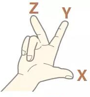

## OSG坐标系理解
- 该坐标系类似于Qt场景坐标系，场景有场景的坐标系，图元有图元的坐标系，视图有视图的坐标系。与此类似，OSG坐标系也相似，差别在于视图坐标系在OSG是相机坐标系。

#### 世界坐标系
- 世界坐标系描述的是整个场景中所有的对象，可以理解为绝对坐标系，所有对象的位置都是绝对坐标。从整体上考虑，它为所有对象的位置提供一个绝对的参考标准，从而避免了物体之间由于独立的物体坐标系而导致的坐标系混乱。

#### 物体坐标系
- 每一个物体都有自己的坐标系，当物体发生交换时，实际上是它本身的坐标系相对于世界坐标系发生变换的过程。
- 物体坐标系通常描述的问题是特定物体的内部对象，主要包括物体的顶点，物体的法向量和物体的方向。

#### 摄像机坐标系
- 摄像机坐标系与屏幕坐标系类似，只不过摄像机坐标系位于3D空间，而屏幕坐标系位于2D空间。

#### 坐标系三轴正方向
- OpenGL坐标系，即z轴正向朝外，y轴正向朝上，x轴正向朝右（符合软件研发标准坐标）
- OSG坐标系，即z轴正向朝上，y轴正向朝前，x轴正向朝右（笛卡尔坐标系）
- DirectX坐标系，即z轴正向朝里，y轴正向朝上，x轴正向朝右（左手坐标系）

#### 笛卡尔坐标系-右手法则
