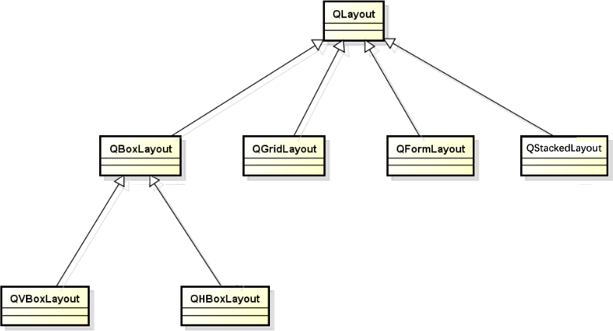

## Qt布局管理详解（5种布局控件）
> 来源： http://c.biancheng.net/view/9422.html

- 实际开发中，一个界面上可能包含十几个控件，手动调整它们的位置既费时又费力。作为一款成熟的 GUI 框架，Qt 提供了很多摆放控件的辅助工具（又称布局管理器或者布局控件），它们可以完成两件事：
	- 自动调整控件的位置，包括控件之间的间距、对齐等；
	- 当用户调整窗口大小时，位于布局管理器内的控件也会随之调整大小，从而保持整个界面的美观。

- 总之借助布局管理器，我们无需再逐个调整控件的位置和大小，可以将更多的精力放在软件功能的实现上。

- Qt 共提供了 5 种布局管理器，每种布局管理器对应一个类，分别是 QVBoxLayout（垂直布局）、QHBoxLayout（水平布局）、QGridLayout（网格布局）、QFormLayout（表单布局）和 QStackedLayout（分组布局），它们的继承关系如下图所示：

#### QVBoxLayout垂直布局
- 垂直布局指的是将所有控件从上到下（或者从下到上）依次摆放。
- 程序中使用 QVBoxLayout 布局控件，需提前引入<QVBoxLayout>头文件。每个 QVBoxLayout 控件本质都是 QVBoxLayout 类的实例对象，该类提供了两个构造函数，分别是：

		QVBoxLayout()
		QVBoxLayout(QWidget *parent)
- 创建 QVBoxLayout 控件的同时可以指定父窗口，那么它将作为父窗口中管理其它控件的工具；也可以暂时不指定父窗口，待全部设置完毕后再将其添加到某个窗口中。
- QVBoxLayout 类没有新增任何成员方法，它只能使用从父类继承的成员方法
- 示例

		#include <QApplication>
		#include <QWidget>
		#include <QLabel>
		#include <QVBoxLayout>
		
		int main(int argc, char *argv[])
		{
		    QApplication a(argc, argv);
		    //创建主窗口
		    QWidget widget;
		    widget.setWindowTitle("QVBoxLayout垂直布局");
		    //创建垂直布局管理器
		    QVBoxLayout *layout=new QVBoxLayout;
		    //设置布局管理器中所有控件从下往上依次排列
		    layout->setDirection(QBoxLayout::BottomToTop);
		   
		    //连续创建 3 个文本框，并设置它们的背景和字体大小
		    QLabel lab1("Label1");
		    lab1.setStyleSheet("QLabel{background:#dddddd;font:20px;}");
		    lab1.setAlignment(Qt::AlignCenter);
		    QLabel lab2("Label2");
		    lab2.setStyleSheet("QLabel{background:#cccccc;font:20px;}");
		    lab2.setAlignment(Qt::AlignCenter);
		    QLabel lab3("Label3");
		    lab3.setStyleSheet("QLabel{background:#ffffff;font:20px;}");
		    lab3.setAlignment(Qt::AlignCenter);
		   
		    //将 3 个文本框和 2 个空白行添加到管理器中，它们的伸缩系数比是 2:1:2:3:3
		    layout->addStretch(2);
		    layout->addWidget(&lab1,1);
		    layout->addWidget(&lab2,2);
		    layout->addWidget(&lab3,3);
		    layout->addStretch(3);
		   
		    //将布局管理器添加到 widget 窗口中
		    widget.setLayout(layout);
		    widget.show();
		    return a.exec();
		}
#### QHBoxLayout水平布局
- 水平布局指的是将所有控件从左到右（或者从右到左）依次摆放
- 使用 QHBoxLayout 水平布局控件，程序中要提前引入<QHBoxLayout>头文件。QHBoxLayout 和 QVBoxLayout 继承自同一个类，它们的用法非常相似，比如 QHBoxLayout 类也提供了两个构造函数：

		QHBoxLayout()
		QHBoxLayout(QWidget *parent)
- QHBoxLayout 类也没有新添任何成员方法，它只能使用从父类继承的成员方法。
- 示例

		#include <QApplication>
		#include <QWidget>
		#include <QLabel>
		#include <QHBoxLayout>
		
		int main(int argc, char *argv[])
		{
		    QApplication a(argc, argv);
		    //创建主窗口
		    QWidget widget;
		    widget.setWindowTitle("QHBoxLayout水平布局");
		    //创建水平布局管理器
		    QHBoxLayout *layout=new QHBoxLayout;
		    //设置布局管理器中所有控件的布局方向为从右往左依次排列
		    layout->setDirection(QBoxLayout::RightToLeft);
		
		    //连续创建 3 个文本框，并设置它们的背景和字体大小
		    QLabel lab1("Label1");
		    lab1.setStyleSheet("QLabel{background:#dddddd;font:20px;}");
		    lab1.setAlignment(Qt::AlignCenter);
		    QLabel lab2("Label2");
		    lab2.setStyleSheet("QLabel{background:#cccccc;font:20px;}");
		    lab2.setAlignment(Qt::AlignCenter);
		    QLabel lab3("Label3");
		    lab3.setStyleSheet("QLabel{background:#ffffff;font:20px;}");
		    lab3.setAlignment(Qt::AlignCenter);
		
		    //将 3 个文本框和 2 个空白列添加到管理器中，它们的拉伸系数比是 2:1:2:3:3
		    layout->addStretch(2);
		    layout->addWidget(&lab1,1);
		    layout->addWidget(&lab2,2);
		    layout->addWidget(&lab3,3);
		    layout->addStretch(3);
		
		    //将布局管理器添加到 widget 窗口中
		    widget.setLayout(layout);
		    widget.show();
		    return a.exec();
		}

#### QGridLayout网格布局
- 网格布局又称格栅布局或者表格布局，指的是将一些控件按照行和列排列在窗口上
- 使用 QGridLayout 网格控件，程序中需引入<QGridLayout>头文件。每个 QGridLayout 控件都是 QGridLayout 类的一个实例对象，该类提供了两个构造函数，分别是：

		QGridLayout(QWidget *parent)
		QGridLayout()
- 示例

		#include <QApplication>
		#include <QWidget>
		#include <QLabel>
		#include <QGridLayout>
		#include <QPushButton>
		int main(int argc, char *argv[])
		{
		    QApplication a(argc, argv);
		    //创建主窗口
		    QWidget widget;
		    widget.setWindowTitle("QGridLayout网格布局");
		    //创建 4 个按钮和 1 个文本框
		    QPushButton *but1 = new QPushButton("but1");
		    QPushButton *but2 = new QPushButton("but2");
		    QLabel *lab3 = new QLabel("lab");
		    lab3->setStyleSheet("QLabel{background:#dddddd;font:20px;}");
		    lab3->setAlignment(Qt::AlignCenter);
		    QPushButton *but3 = new QPushButton("but3");
		    QPushButton *but4 = new QPushButton("but4");
		    //创建网格布局控件
		    QGridLayout *layout = new QGridLayout;
		    //向 layout 中添加控件，并指定各个控件的位置
		    layout->addWidget(but1, 0, 0);
		    layout->addWidget(but2, 0, 2);
		    layout->addWidget(lab3, 1, 0, 3, 3);
		    layout->addWidget(but3, 4, 0);
		    layout->addWidget(but4, 4, 2);
		    //将 layout 添加到 widget 窗口中
		    widget.setLayout(layout);
		    widget.show();
		    return a.exec();
		}

#### QFormLayout表单布局
- Qt 提供了很多种输入框控件，包括 QLineEdit 单行输入框、QTextEdit 多行输入框等。通常情况下，每个输入框的旁边都会附带一些文字（又称标签），用来提示用户需要输入的信息。
- QFormLayout 可以容纳很多个输入框以及对应的标签，并将它们从上到下依次排列在界面上。大多数情况下，QFormLayout 底层是用 QGridLayout 网格布局管理器实现的，和后者不同的是，QFormLayout 只包含 2 列（不限制行数），且第一列放置标签，第二列放置输入框。

- 使用 QFormLayout 布局控件之前，程序中应引入<QFormLayout>头文件。每一个表单布局控件都是 QFormLayout 类的一个实例对象，该类仅提供了一个构造函数：

		QFormLayout(QWidget *parent = Q_NULLPTR)
- 示例

		#include <QApplication>
		#include <QWidget>
		#include <QLineEdit>
		#include <QFormLayout>
		int main(int argc, char *argv[])
		{
		    QApplication a(argc, argv);
		    //创建主窗口
		    QWidget widget;
		    widget.setWindowTitle("QFormLayout表单布局");
		    //创建 4 个按钮和 1 个文本框
		    QFormLayout* layout = new QFormLayout();
		    //设置表单中的标签都位于控件的上方
		    layout->setRowWrapPolicy(QFormLayout::WrapAllRows);
		    //添加 3 行输入框和标签
		    layout->addRow("Name:",new QLineEdit());
		    layout->addRow("Email:",new QLineEdit());
		    layout->addRow("Adress:",new QLineEdit());
		    //设置行间距和列间距为 10
		    layout->setSpacing(10);
		    //将 layout 表单添加到 widget 窗口中
		    widget.setLayout(layout);
		    widget.show();
		    return a.exec();
		}

#### QStackedLayout分组布局
- QStackedLayout 布局管理器可以容纳多个控件或者窗口，但每次只显示其中的一个。
- 使用 QStackedLayout 布局控件，程序中必须先引入<QStackedLayout>头文件。 每个 QStackedLayout 控件都是 QStackedLayout 类的一个实例对象，该类提供有 3 个构造函数，分别是：

		QStackedLayout()
		QStackedLayout(QWidget *parent)
		QStackedLayout(QLayout *parentLayout)
	借助第二个构造函数，我们可以将 QStackedLayout 添加到指定的 parent 窗口中；借助第三个构造函数，我们可以将 QStackedLayout 嵌入到指定的 parentLayout 布局控件中

